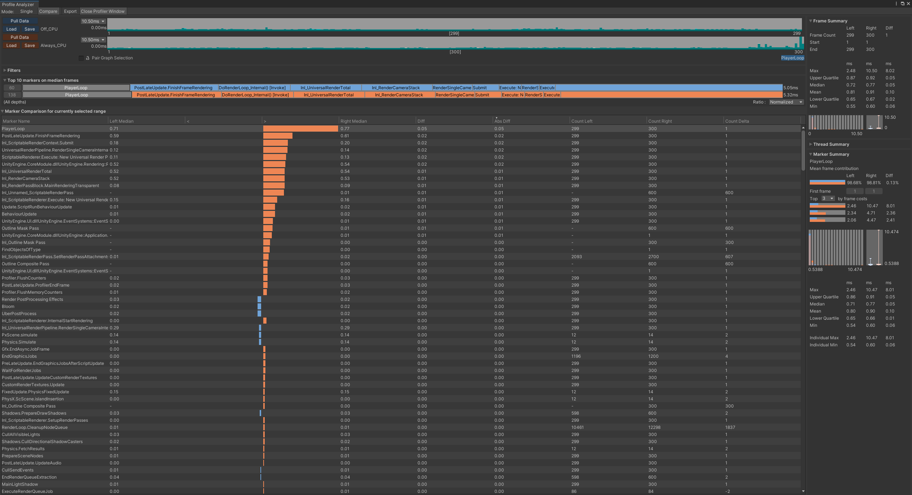
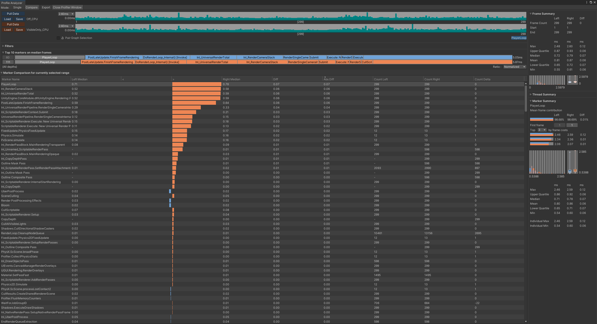

# URP Rendering Showcase

一个面向 Unity 中高级客户端/渲染岗位的 URP 技术展示项目。项目以可交互场景为载体，重点展示自定义 `ScriptableRendererFeature`、屏幕空间描边、深度遮挡、Shader 效果、运行时资源管理，以及基于 Unity Profiler 的性能定位与验证流程。

## 项目环境

- Unity `2022.3.51f1 LTS`
- Universal Render Pipeline `14.0.11`
- C# / ShaderLab / HLSL
- 主要验证平台：Windows Standalone
- 性能分析：Unity Profiler + Profile Analyzer

## 功能概览

- 鼠标射线选择与选中状态管理
- 基于 URP RendererFeature 的屏幕空间描边
- `Always` 与 `VisibleOnly` 两种遮挡模式
- 运行时调整描边开关、模式和像素宽度
- 基于 MaterialPropertyBlock 的 Dissolve 效果
- PBR 金属度/粗糙度材质对照
- HDR Emission 与 URP Bloom 展示
- Frame Debugger 渲染顺序验证
- CPU、GPU、Draw Call 和 GC 性能采集

## 屏幕空间描边架构

描边不是传统的模型顶点外扩，而是由两个自定义 `ScriptableRenderPass` 完成：

```text
SelectionSystem
      ↓
OutlineTargetRegistry
      ↓
ScreenSpaceOutlineFeature
      ├─ Outline Mask Pass
      │    ├─ 将选中 Renderer 写入 R8 Mask RTHandle
      │    └─ VisibleOnly 模式下采样 Camera Depth 并剔除遮挡片元
      │
      └─ Outline Composite Pass
           ├─ 绘制 Procedural Fullscreen Triangle
           ├─ 对 Mask 进行 8 邻域膨胀
           └─ dilatedMask - centerMask 得到目标外侧边缘
```

两个 Pass 默认注入在 `AfterRenderingOpaques`，描边完成后再进入 URP 后处理。

### Mask Pass

- 使用 `R8_UNorm` RTHandle，仅保存单通道 Mask。
- 关闭深度缓冲、MSAA 和 Mipmap，减少不必要的资源成本。
- 使用独立 Mask Material 调用 `DrawRenderer` 绘制当前注册的目标，并支持多 SubMesh。
- `Always` 模式不请求相机深度。
- `VisibleOnly` 模式通过 `ConfigureInput(Depth)` 按需请求深度纹理，并在眼空间比较目标深度与场景深度。

### Composite Pass

- 使用 `SV_VertexID` 生成覆盖屏幕的三角形，不创建额外全屏 Mesh。
- 按像素宽度采样 Mask 的水平、垂直和对角方向。
- 通过 `saturate(dilated - center)` 只保留模型外侧轮廓。
- 使用 Alpha Blend 将描边合成回 Camera Color Target。

### RendererFeature 生命周期

- `Create`：创建材质和 Pass 实例。
- `AddRenderPasses`：检查运行时开关、目标集合和相机类型，并按条件入队 Pass。
- `SetupRenderPasses`：在合法生命周期内获取 `cameraColorTargetHandle`。
- `Dispose`：释放运行时材质与 RTHandle。
- 支持 Game Camera 和 Scene View Camera，主动跳过 Overlay Camera。

## 性能设计与优化

### 空目标快速跳过

`OutlineTargetRegistry` 只保存当前真正需要描边的目标。当功能关闭或目标集合为空时，RendererFeature 不入队 Mask 和 Composite Pass，避免无意义的 RTHandle 和全屏绘制开销。

### 深度纹理按需申请

只有 `VisibleOnly` 模式调用 `ConfigureInput(Depth)`。`Always` 模式不会因为描边功能额外触发 CopyDepth 或 Depth Prepass。

### 每帧 GC 优化

初次采集发现 Mask Pass 每帧产生 `40 B GC Alloc`。问题来自 `HashSet<T>` 通过 `IReadOnlyCollection<T>` 进行 `foreach` 时，值类型枚举器被装箱为接口对象。

最终将注册表调整为低频注册、高频索引遍历的结构：

- 使用 `List<OutlineTarget>` 保存活动目标。
- 通过 `IReadOnlyList<OutlineTarget>` 暴露只读访问。
- 使用索引 `for` 循环遍历，避免枚举器装箱。
- 重用 `List<Material>` 并调用 `GetSharedMaterials(List)`，避免每帧创建材质数组。

复测结果从 `40 B/frame` 降至 `0 B/frame`。

### 可验证的 Profiling Marker

Mask 和 Composite Pass 分别使用独立的 `ProfilingSampler`。CommandBuffer 从池中以无名称方式获取，避免命名 CommandBuffer 与 `ProfilingScope` 生成重复或错位的性能标记。

## 性能结果

测试环境：Windows Standalone Development Build，VSync 与 Deep Profile 关闭。GPU Profiling 时临时关闭 Graphics Jobs，以绕开 Unity 2022.3 的 GPU Profiler 限制。CPU 使用 Profile Analyzer 分析约 300 帧，GPU 使用 7 个固定帧样本的中位数。

测试硬件：AMD Ryzen 9 3950X、NVIDIA GeForce RTX 2080 Ti、48 GB RAM。

### 整体开销

| 模式 | CPU 中位数 | CPU 增量 | GPU 中位数 | GPU 增量 | Batches¹ | SetPass¹ | GC/frame |
|---|---:|---:|---:|---:|---:|---:|---:|
| Off | 0.72 ms | — | 0.22 ms | — | 44 | 26 | 0 B |
| Always | 0.77 ms | +0.05 ms | 0.27 ms | +0.05 ms | 46 | 31 | 0 B |
| VisibleOnly | 0.79 ms | +0.07 ms | 0.28 ms | +0.06 ms | 47 | 32 | 0 B |

¹ Batches 与 SetPass 为同一稳定代表帧的数据，其余时间项为多帧中位数。该结果用于比较本项目内三种模式，不代表其他硬件、分辨率或场景复杂度下的绝对性能。

### GPU Pass 中位数

| GPU Pass | Always | VisibleOnly |
|---|---:|---:|
| Outline Composite | 0.051 ms | 0.047 ms |
| Outline Mask | < 0.001 ms | 0.004 ms |
| CopyDepth | — | 0.018 ms |

Composite 是主要 GPU 成本，因为它执行全屏邻域采样。VisibleOnly 额外承担目标深度比较和 CopyDepth 成本。Always 中 Mask 的显示值低于当前 Profiler 的计时精度，不表示完全没有执行成本。

### Profile Analyzer 对比

#### Off vs Always



#### Off vs VisibleOnly



原始对比数据：

- [Off vs Always CSV](Documentation/Profiling/Off_vs_Always.csv)
- [Off vs VisibleOnly CSV](Documentation/Profiling/Off_vs_VisibleOnly.csv)

## 操作方式

| 输入 | 功能 |
|---|---|
| 鼠标左键 | 选择场景对象 |
| `F` | 播放当前目标的 Dissolve |
| `G` | 重置当前目标的 Dissolve |
| `O` | 开启/关闭屏幕空间描边 |
| `M` | 切换 Always / VisibleOnly |
| `[` / `]` | 减小/增加描边宽度 |

## 运行项目

1. 使用 Unity `2022.3.51f1` 或兼容的 `2022.3 LTS` 版本打开项目。
2. 打开 `Assets/Art/Scenes/Demo_Main.unity`。
3. 进入 Play Mode。
4. 使用鼠标和快捷键切换目标及渲染效果。

`Demo_Main` 已加入 Build Settings，可直接构建 Windows Standalone 版本。

## 目录结构

```text
Assets/
├─ Art/Scenes/Demo_Main.unity
├─ Scripts/Rendering/
│  ├─ Outline/
│  │  ├─ ScreenSpaceOutlineFeature.cs
│  │  ├─ OutlineMaskPass.cs
│  │  ├─ OutlineCompositePass.cs
│  │  ├─ OutlineTargetRegistry.cs
│  │  └─ OutlineTarget.cs
│  ├─ DissolveController.cs
│  ├─ RenderEffectPresenter.cs
│  └─ RenderEffectTarget.cs
└─ Shaders/
   ├─ Outline/
   │  ├─ OutlineMask.shader
   │  └─ OutlineComposite.shader
   └─ Dissolve/Dissolve_URP.shader

Documentation/
└─ Profiling/
   ├─ Off_vs_Always.png
   ├─ Off_vs_VisibleOnly.png
   ├─ Off_vs_Always.csv
   └─ Off_vs_VisibleOnly.csv
```

## 当前限制与取舍

- 一个 `OutlineTarget` 当前对应一个 Renderer。多 Renderer 角色需要增加聚合组件或子 Renderer 注册机制。
- Mask 与 Composite 当前按全分辨率执行；在高分辨率或移动平台上可增加半分辨率质量档位。
- 固定 8 邻域膨胀适合本 Demo 的 1–4 px 描边，超宽轮廓需要更适合的扩张策略。
- VisibleOnly 依赖不透明物体深度；默认不处理未写入 Camera Depth 的透明遮挡物。
- Overlay Camera 被主动跳过，尚未实现 Camera Stack 的独立描边策略。
- 当前性能数据来自高端桌面硬件，移动端结论需要重新采集。

## 面试讨论点

- `ScriptableRendererFeature` 与 `ScriptableRenderPass` 的生命周期和注入顺序。
- RTHandle 的申请、复用和释放。
- `SetupRenderPasses` 中访问 Camera Color Target 的原因。
- Mask、屏幕空间膨胀与全屏三角形的实现方式。
- Always 与 VisibleOnly 的视觉效果、深度成本和适用场景。
- 如何从 Profiler 的 `40 B/frame` 定位到接口枚举器装箱。
- 为什么优化高频遍历路径，并把 O(n) 判重留在低频注册路径。
- 如何区分 CPU、GPU、Draw Call、SetPass 和 GC 指标。
- 如何通过 Frame Debugger 与 Profile Analyzer 验证实现和优化结果。

## 后续扩展

- 多 Renderer 角色的统一目标注册。
- 半分辨率 Mask 与质量分级。
- 不同目标的独立描边颜色与宽度。
- Shader Variant 统计与剔除策略。
- Windows 与移动端的分平台性能对比。

## 作者

Zhangshu — Unity Client Developer / Rendering Focus
